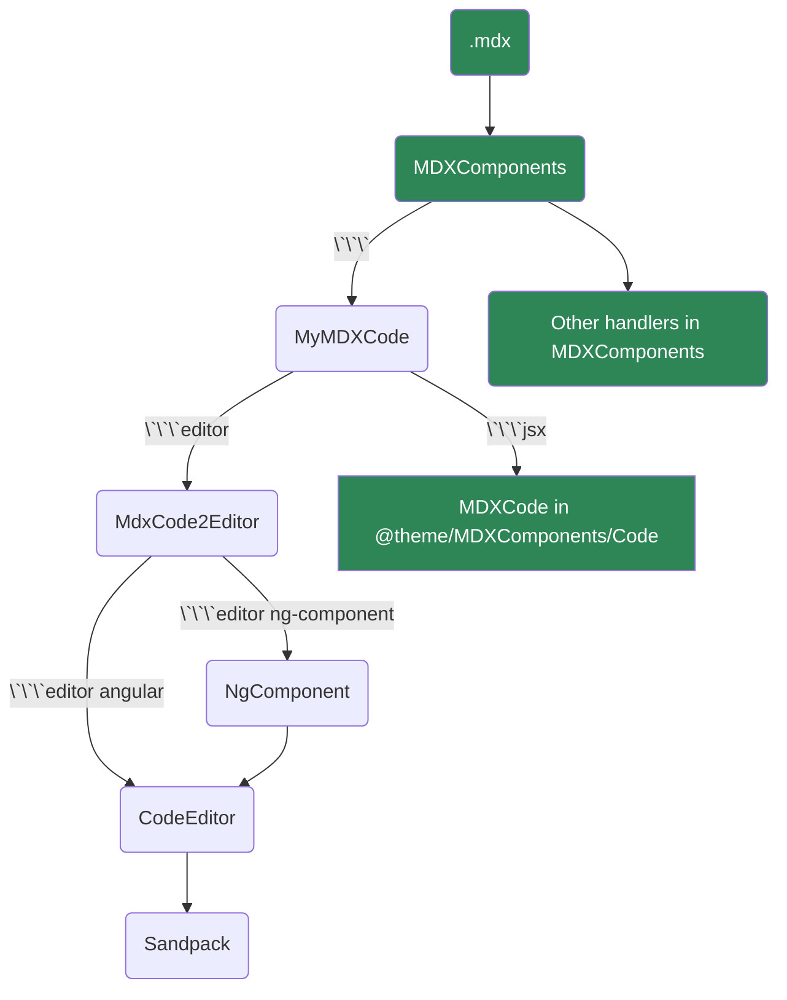

# Code Editor

## Angular

:::tip
The following code block will render an editor for Angular project
:::

````
```editor angular showFileExplorer
///file /src/app/data.ts
export const appTitle = "Angular";

///file /src/app/remote-data.ts  https://localhost/remote-data.ts

///file /src/app/app.component.html
<h1 class="p-4 text-center"> {{ appTitle }}</h1>

///file /src/app/app.component.ts
import { Component } from "@angular/core";
import { appTitle } from '/src/app/data.ts';

@Component({
  selector: "app-root",
  templateUrl: "./app.component.html",
  styleUrls: ["./app.component.css"]
})
export class AppComponent {
  appTitle = appTitle;
}           
```
````

```editor angular showFileExplorer
///file /src/app/data.ts
export const appTitle = "Angular";

///file /src/app/remote-data.ts  https://localhost/remote-data.ts

///file /src/app/app.component.html
<h1 class="p-4 text-center"> {{ appTitle }}</h1>

///file /src/app/app.component.ts
import { Component } from "@angular/core";
import { appTitle } from '/src/app/data.ts';

@Component({
  selector: "app-root",
  templateUrl: "./app.component.html",
  styleUrls: ["./app.component.css"]
})
export class AppComponent {
  appTitle = appTitle;
}           
```

### NG Component


````
```editor ng-component showFileExplorer showLineNumbers
///file /src/app/data.ts
export const appTitle = "Angular";

///file /src/app/data1.ts
export const appTitle = "Angular1";

///ts
import { VERSION } from '@angular/core';
import { Component } from "@angular/core";
import { appTitle } from '/src/app/data';

@Component({
  selector: "app-root",
  templateUrl: "./app.component.html",
  styleUrls: ["./app.component.css"]
})
export class AppComponent {
  title = appTitle;
  version = VERSION.full;
}

///html
<div class="text-center pt-4">
<h1>{{ title }} <small>v{{ version }}</small></h1>
<p>This is an angular component example.</p></div>

///css
p {
  color: #696767ff
}
```
````


```editor ng-component showFileExplorer showLineNumbers
///file /src/app/data.ts
export const appTitle = "Angular";

///file /src/app/data1.ts
export const appTitle = "Angular1";

///ts
import { VERSION } from '@angular/core';
import { Component } from "@angular/core";
import { appTitle } from '/src/app/data';

@Component({
  selector: "app-root",
  templateUrl: "./app.component.html",
  styleUrls: ["./app.component.css"]
})
export class AppComponent {
  title = appTitle;
  version = VERSION.full;
}

///html
<div class="text-center pt-4">
<h1>{{ title }} <small>v{{ version }}</small></h1>
<p>This is an angular component example.</p></div>

///css
p {
  color: #696767ff
}
```


## React

````
```editor react showFileExplorer showLineNumbers
```
````

```editor react showFileExplorer showLineNumbers
```

## Vue.js

````
```editor vue showFileExplorer showLineNumbers
```
````

```editor vue showFileExplorer showLineNumbers
```

## How to work

