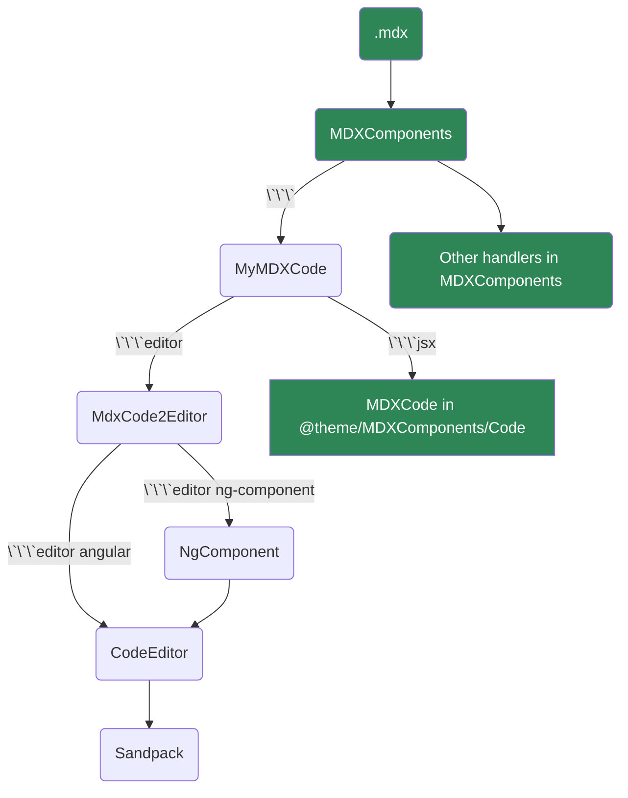

# Code Editor

## Angular

:::tip
The following code block will render an editor for Angular project
:::

````
```editor angular
///file /src/app/data.ts
export const appTitle = "Angular";

///file /src/app/remote-data.ts  https://localhost/remote-data.ts

///file /src/app/app.component.html
<h1 class="p-4 text-center"> {{ appTitle }}</h1>

///file /src/app/app.component.ts
import { Component } from "@angular/core";
import { appTitle } from '/src/app/data.ts';

@Component({
  selector: "app-root",
  templateUrl: "./app.component.html",
  styleUrls: ["./app.component.css"]
})
export class AppComponent {
  appTitle = appTitle;
}           
```
````

```editor angular
///file /src/app/data.ts
export const appTitle = "Angular";

///file /src/app/remote-data.ts  https://localhost/remote-data.ts

///file /src/app/app.component.html
<h1 class="p-4 text-center"> {{ appTitle }}</h1>
<small class="text-center d-block" *ngIf="hostTheme">Current theme: {{ hostTheme }}</small>

///file /src/app/app.component.ts
import { Component, NgZone, OnDestroy, OnInit } from "@angular/core";
import { appTitle } from '/src/app/data.ts';

@Component({
  selector: "app-root",
  templateUrl: "./app.component.html",
  styleUrls: ["./app.component.css"]
})
export class AppComponent implements OnInit, OnDestroy {
  appTitle = appTitle;
  hostTheme = '';

  constructor() {
    const params = new URL(location.href).searchParams;
    this.hostTheme = params.get('theme') || '';
  }
}           
```

### NG Component


````
```editor ng-component hideFileExplorer hideLineNumbers
///file /src/app/data.ts
export const appTitle = "Angular";

///file /src/app/data1.ts
export const appTitle = "Angular1";

///ts
import { VERSION } from '@angular/core';
import { Component } from "@angular/core";
import { appTitle } from '/src/app/data';

@Component({
  selector: "app-root",
  templateUrl: "./app.component.html",
  styleUrls: ["./app.component.css"]
})
export class AppComponent {
  title = appTitle;
  version = VERSION.full;
}

///html
<div class="text-center pt-4">
<h1>{{ title }} <small>v{{ version }}</small></h1>
<p>This is an angular component example.</p></div>

///css
p {
  color: #696767ff
}
```
````


```editor ng-component hideFileExplorer hideLineNumbers
///file /src/app/data.ts
export const appTitle = "Angular";

///file /src/app/data1.ts
export const appTitle = "Angular1";

///ts
import { VERSION } from '@angular/core';
import { Component } from "@angular/core";
import { appTitle } from '/src/app/data';

@Component({
  selector: "app-root",
  templateUrl: "./app.component.html",
  styleUrls: ["./app.component.css"]
})
export class AppComponent {
  title = appTitle;
  version = VERSION.full;
}

///html
<div class="text-center pt-4">
<h1>{{ title }} <small>v{{ version }}</small></h1>
<p>This is an angular component example.</p></div>

///css
p {
  color: #696767ff
}
```


## React

````
```editor react hideTabs
```
````

```editor react hideTabs
```

## Vue.js

````
```editor vue
```
````

```editor vue
```

## Put local files into the editor

First to add a package into **node_modules** folder.
```js
import bundleJs from "!!raw-loader!./bundle.js"; // load the source code of bundle.js

files['/node_modules/@bndynet/my-lib/package.json'] = {
  hidden: true,
  code: JSON.stringify({
    name: '@bndynet/my-lib',
    main: './index.js',
  }),
};
files['/node_modules/@bndynet/my-lib/index.js'] = {
  hidden: true,
  code: `${bundleJs}`,
};
```

Then you can import it in your code.
```js
import { myFunction } from '@bndynet/my-lib';
myFunction();
```


## How it works

